# 🎯 InterviewReady - AI-Powered Resume Matcher & ATS Tailor Engine

[](https://nextjs.org/)
[](https://www.typescriptlang.org/)
[](https://tailwindcss.com/)
[](https://opensource.org/licenses/MIT)

**InterviewReady** is an engineering-first, responsive web dashboard designed to help job seekers bypass traditional ATS (Applicant Tracking System) filters. The application parses resume text, matches it against target job descriptions in real-time, extracts missing core keywords, and suggests quantified, metric-driven bullet points for immediate optimization.

---

## 🚀 Engineering Highlights & Technical Architecture

This application was engineered with professional software standards, prioritizing performance, SEO/AISO discoverability, and system resilience.

```mermaid
graph TD
    A[User Input: Job Description & Resume] --> B{API Key Configured?}
    B -- Yes --> C[Google Gemini API Route /api/analyze]
    B -- No / Failure --> D[Local Semantic Overlap Fallback Engine]
    C --> E[Dynamic ATS score & quantified AI rewrites]
    D --> F[Simulated keyword match rate & regex-based audits]
    E --> G[Interactive Dashboard View]
    F --> G[Interactive Dashboard View]
```



### 1. Hybrid Dual-Engine Matching System
* **Primary AI Engine**: Uses a serverless Next.js API route that connects securely to the **Google Gemini API** (`gemini-1.5-flash`). It performs deep semantic audits, classifies job titles from short inputs (inference mode), and generates context-aware, metric-focused copywriting rewrites.
* **Resilient Local Fallback Engine**: If no API key is provided or a network request fails, the application immediately cascades to a client-side keyword matching fallback engine. This ensures a 100% uptime guarantees and instantaneous match updates.

### 2. Search & AI Engine Optimization (SEO / GEO)
* **Google Sitelinks Search Box**: Fully integrated JSON-LD structured data representing the platform as a `SoftwareApplication` and a `WebSite` containing Google `SearchAction` attributes.
* **Organic Rich Snippets**: Implemented `AggregateRating` schema tags to display **golden star ratings** in organic search listings (increasing CTR by up to 30%).
* **GEO (Generative Engine Optimization)**: Declares application parameters, capabilities, and benchmarks using a custom `llms.txt` file at the root to maximize visibility in AI-powered search engines like Perplexity, ChatGPT Search, and Gemini.

### 3. High-Performance Frontend Architecture
* Built using **Next.js 16 (App Router)** and built-in static optimization rules.
* Styled using **Tailwind CSS v4** utilizing HSL variables for a sleek, high-contrast teal light-mode dashboard.
* Responsive UI animations including interactive animated SVG progress gauges, badge tag removals, dynamic tab structures, and copy-to-clipboard notifications.

---

## 🛠️ Feature Set

* **Dual Audit Gauges**: Displays separate animated matching scores for **Keyword Matching** and **ATS Formatting Readiness** (verifying phone numbers, email headers, and standard sections).
* **Missing Keywords Badge Bar**: Displays tools, languages, and competencies missing from the resume, allowing candidates to add or delete keywords interactively.
* **Quantified Copywriting Tailoring**: Renders side-by-side card reviews demonstrating "Original" weak bullets compared to "Tailored AI Rewrites" showing metric-driven achievements.
* **Preloaded Industry Templates**: Features a one-click mock data loader to instantly demonstrate the system with software development, marketing, PM, and nursing profiles.

---

## 💻 Tech Stack

* **Framework**: Next.js 16 (App Router)
* **Styling**: Tailwind CSS v4 (with PostCSS configuration)
* **Language**: TypeScript (100% type-safe compilation)
* **Icons**: Lucide React
* **Analytics**: Next.js Third Parties (Google Analytics)

---

## ⚙️ Local Installation & Development

To run this project locally on your machine, follow these instructions:

### 1. Clone the repository
```bash
git clone https://github.com/roshanroy-lang/resume_matcher..git
cd resume_matcher
```

### 2. Install dependencies
```bash
npm install
```

### 3. Add Environment Variables (Optional)
Create a `.env.local` file at the root of the project to enable Gemini API features:
```env
GEMINI_API_KEY=your_google_gemini_api_key
```

### 4. Run the Dev Server
```bash
npm run dev
```
*Open [http://localhost:3000](http://localhost:3000) in your browser to inspect.*

---

## 🌐 Production Deployment

The project compiles with standalone output tracing optimized for hosting on **Vercel**:
1. Log into Vercel and import the repository.
2. The platform will auto-detect Next.js and compile production assets.
3. Configure your `GEMINI_API_KEY` in the Vercel dashboard environment settings to enable live AI responses.
